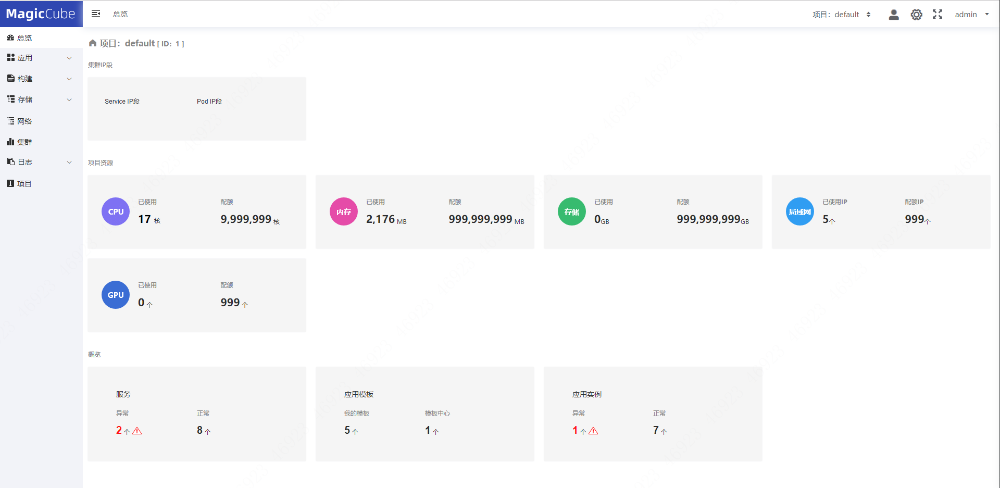

# To recreate these results

## 1.Introduction

Based on intelligent cloud service of Dahua video, Dahua Magic Cube Platform is an intelligent-application center platform that provides rich cloud services, which including hardware resource pooling, resource allocation on demand, continuous integration(CI), continuous delivery(CD) and so on.

The overall architecture of Dahua Magic Cube Platform:


**Key Features of MagicCube Platform**

**K8s Resource Management** : Provide a web console for creating and managing Kubernetes resources;provide native, scalable and compatible Kubernetes API that enables enterprises to migrate toward cloud business seamlessly.

**Efficient Management and Scheduling**：Support for mass hardware devices, network traffic and batch tasks; support deployment of multiple services in a stable and efficient manner to help users to improve resource utilization significantly.

**Storage Management**: Support multiple storage types, on-demand allocation of storage resources;support local storage and distributed storage scheduling.
Network Management: Support single cluster with multi-network; support load balancing; support real and fixed IP.

**Application template orchestration**: Application template lifecycle management, startup sequence of visual orchestration, multi-environment rapid deployment service.

**Multi-tenant Management**：Provide unified authentication with fine-grained roles and three-tier authorization system.


**Components List**

| Component      | Function description                                         |
| -------------- | ------------------------------------------------------------ |
| Infrastructure | supports ARM architecture, GPU management, CPU management and etc. |
| K8S/Docker     | provides application orchestration and container runtime interface |
| Network        | supports Calico/Macvlan network policy                       |
| Storage        | supports distributed Ceph storage and local PV               |
| App Monitoring | provides monitoring metrics and services of nodes, pods, middleware and API object |
| Harbor         | provides images registry center                              |

These are some symbolic displays of Dahua Magic Cube Platform:

- First, the Project Overview of Dahua Magic Cube.



- Second, the detail information of work node.


- Three, the detail information include the usage of CPU, network bandwidth, the amount of memory.


## 2.Install Dahua Magic Cube Platform（Private Clouds）

**Instruction:** We install Dahua Magic Cube Platform by using Ansible tool

**config parameters**

```
[master]
master1_ip=
master2_ip=
master3_ip=

[k8s]
keepalived_virtual_router_id=
rabbit_vrrp_id=
harbor_vrrp_route_id=

keepalived_vip=
rabbit_vip=
mysql_vip=

ntp_server=

harbor_registry=
```

**Step1**. Prepare three master node with CentOS 7.7 and one worker node

**Step2**. Prepare the required dependent environment of Kubernetes

- config hostname for three master node and use master1_ip, master2_ip and master3_ip in config file
- stop firewall and disable selinux
- config ntpdate for timesync
- use cfssl tool to generate certificates

**Step3**. Install base components

- use etcd binary file and etcd.service to deploy three etcd on three master node
- deploy docker service 
- deploy nginx and keepalived and use keepalived_virtual_router_id and keepalived_vip in config file
- deploy some middleware by using docker that including redis, mysql, influxdb and rabbitmq
- deploy harbor for storing cube images and use harbor_vrrp_route_id and harbor_registry like image.cube.com in config file
- install helm
- Install ceph for storage

**Step4**. Install kubernetes v1.19 with a binary deployment

- install kubectl  by using a binary file of kubectl
- install apiserver by using a binary file of kube-apiserver and a config file of kube-apiserver.service
- install controller-manager by using a binary file of kube-controller-manager and a config file of kube-controller-manager.service
- install scheduler by using a binary file of kube-scheduler and a config file of kube-scheduler.service
- install kubelet by using a binary file of kubelet  and a config file of kubelet .service
- install kube-proxy by using a binary file of kube-proxy  and a config file of kube-proxy .service

**Step5**. Install addon plugin like as Calico CNI and CoreDNS

- install calico cni and coredns with helm
- install GPU device plugin with helm
- Install metric server with helm

**Step6**. Install Dahua Magic Cube components

- Install application store service for deploying some cloud application
- Install network management service for providing network configuration
- Install storage management service for providing ceph block and filesystem
- Install node management service for establishing work cluster


## 3.Run Conformance Tests

- Download Sonobuoy (0.52.0)

```
wget https://github.com/vmware-tanzu/sonobuoy/releases/download/v0.52.0/sonobuoy_0.52.0_linux_amd64.tar.gz
tar -xzf sonobuoy_0.52.0_linux_amd64.tar.gz
mv sonobuoy /usr/local/bin
```

- Prepare images

```
docker pull sonobuoy/sonobuoy:v0.52.0
docker pull sonobuoy/systemd-logs:v0.3
docker pull k8s.gcr.io/conformance:v1.19.4
```

- Run Sonobuoy

```
sonobuoy run --kubeconfig=/root/.kube/config --image-pull-policy=IfNotPresent --mode=certified-conformance --wait
```

- Check the status

```
sonobuoy status --kubeconfig=/root/.kube/config
```

- Inspect the logs

```
sonobuoy logs --kubeconfig=/root/.kube/config
```

- Once `sonobuoy status` shows the run as `completed`, download the results tar.gz file

```
result=$(sonobuoy retrieve --kubeconfig=/root/.kube/config)
tar xzf $result -C results/
```
