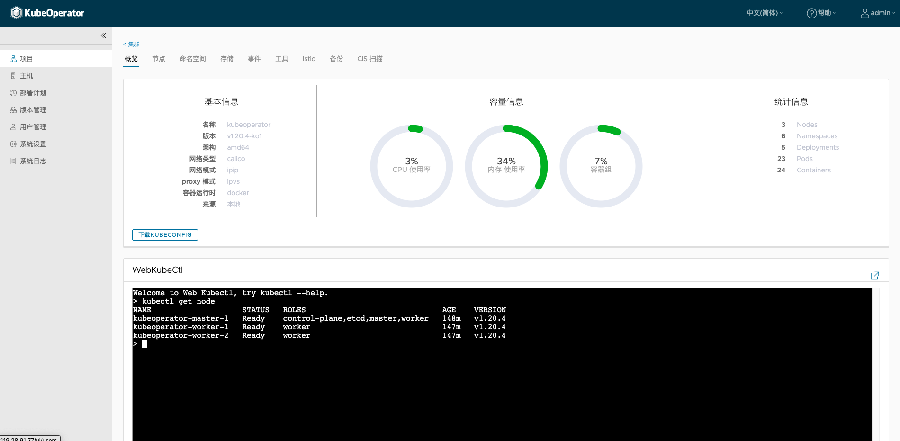

# Conformance tests for KubeOperator 3.6.0

## Install KubeOperator 3.6.0

Follow the [installation](https://kubeoperator.io/docs/installation/install/) to install KubeOperator.

```bash
$ curl -sSL https://github.com/KubeOperator/KubeOperator/releases/latest/download/quick_start.sh | sh
```

Wait until service running successfully.

## Deploy Kubernetes

Deploy Kubernetes according to the [documentation](https://kubeoperator.io/docs/quick_start/cluster_planning/manual/).

1. System Settings
- Before using the KubeOperator, you must set the necessary parameters for the KubeOperator. These system parameters will affect the installation of the Kubernetes cluster and access to related services.

2. Prepare The Servers
- We will prepare to add three servers, one master and two workers.

3. Host Authorization
- Authorize the host to the project.

4. Deploy Cluster
- Enter the project menu and click the "Add" button on the "Cluster" page to create the cluster.


## Run Conformance Test

1. Download a sonobuoy [binary release](https://github.com/vmware-tanzu/sonobuoy/releases) of the CLI, or build it yourself by running:

```bash
$ go get -u -v github.com/vmware-tanzu/sonobuoy
```

2. Run sonobuoy:

```bash
$ sonobuoy run --mode=certified-conformance
```

3. Watch the logs:

```bash
$ sonobuoy logs
```

4. Check the status:

```bash
$ sonobuoy status
```

5. Once the status shows the run as completed, you can download the results archive by running:

```bash
$ sonobuoy retrieve
```

Please refer to [sonobuoy.tar.gz](sonobuoy.tar.gz) for the result.